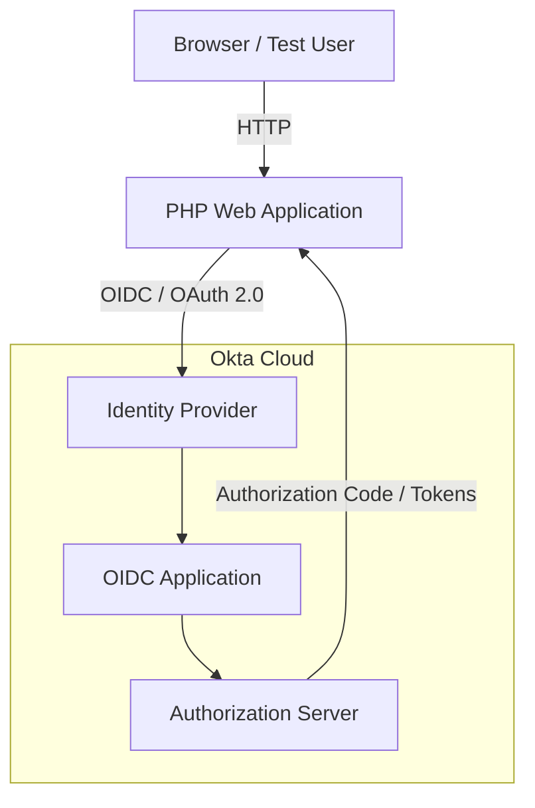
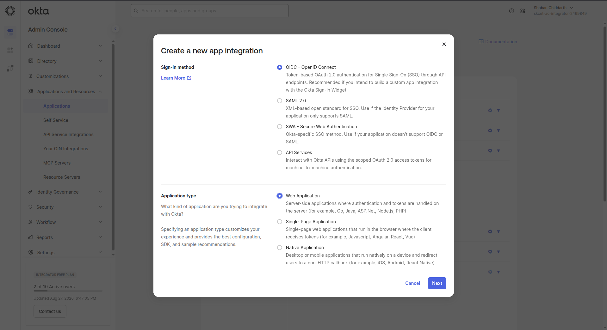
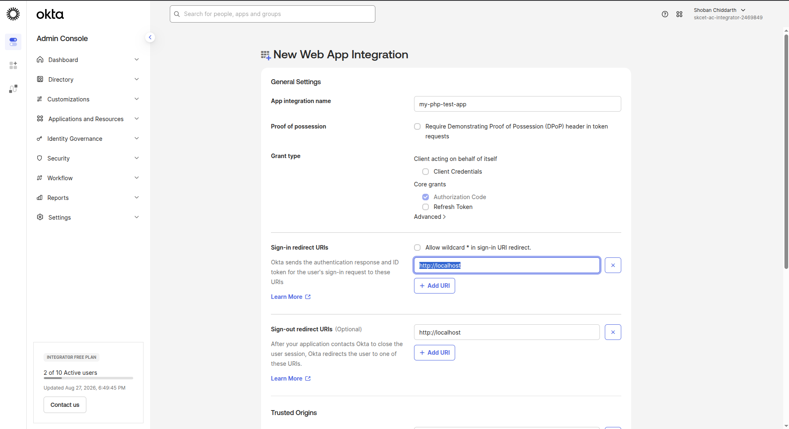
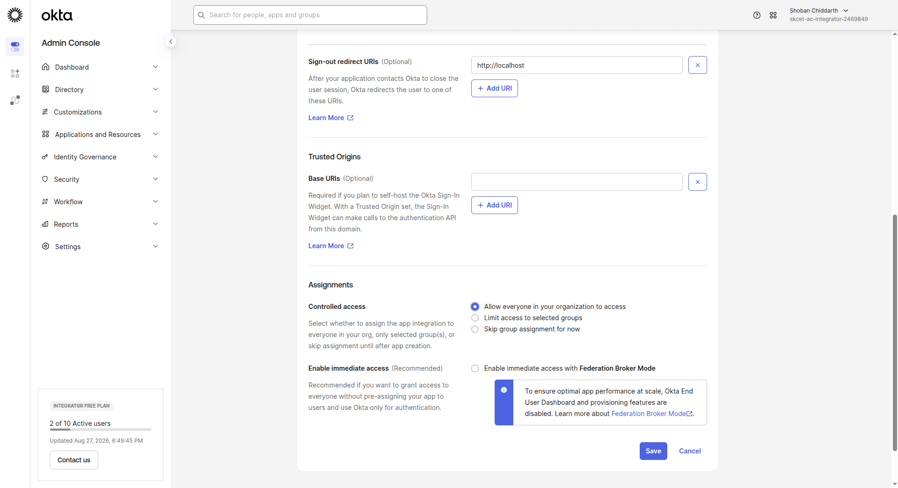
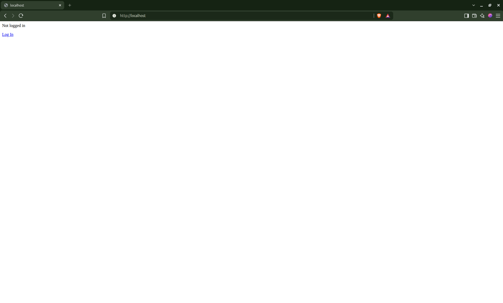
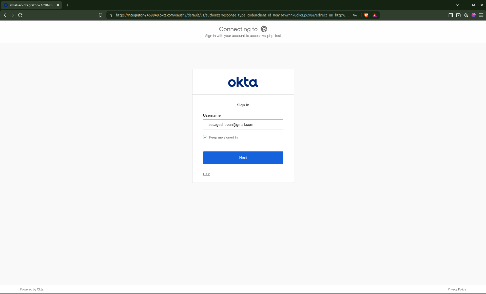
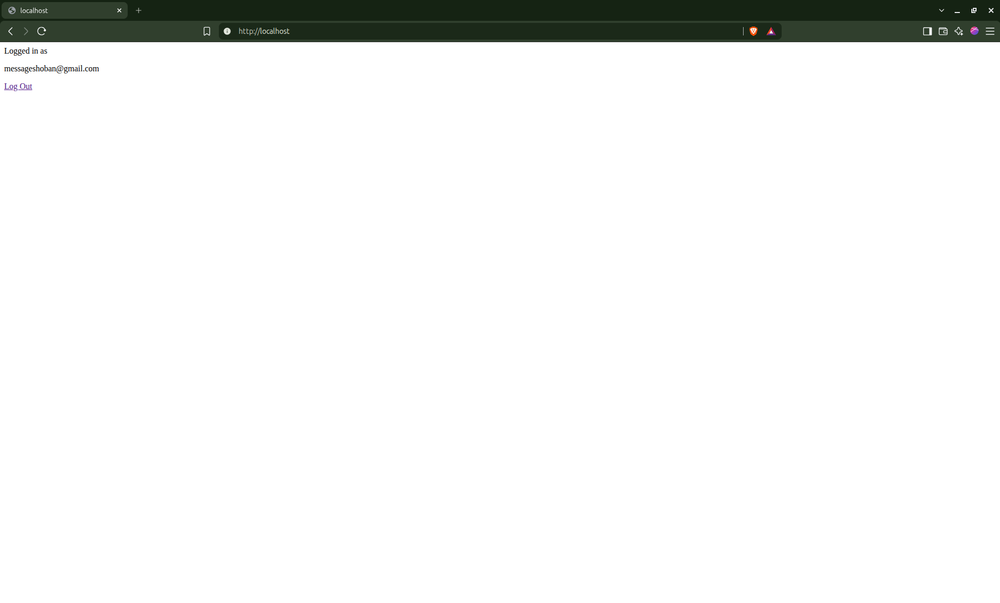

# Okta SSO Lab (OIDC) - Technical Write Up

This is an Identity and Access Management (IAM) cybersecurity home lab demonstrating Single Sign-On (SSO) using Okta and OpenID Connect (OIDC).

The lab consists of a locally hosted PHP web application integrated with an Okta OIDC application. The purpose of the lab is to understand how an Identity Provider authenticates users, how application access is controlled, how OAuth authorization policies affect access, and how IAM failures can be investigated using identity-provider logs.

## Objectives

1. Configure Okta as an Identity Provider
2. Create and configure an OIDC web application
3. Create test users in Okta
4. Configure application assignments
5. Run the application
6. Login via SSO, and then logout

## Lab Architecture



## Setup

### Okta App Integration Creation

1. Open The Okta Admin Console, Go to **Application and Resources** `->` **Applications** and create a new app integration
2. Select **OIDC** and **Web Application** and click on next



3. Name the app, and set Sign in and Sign out redirect URLIs to

```
http://localhost
```



4. On "Assignments" select "Allow everyone in your organization to access" and disable federation broker mode. Then click on Save.




### Client Config

1. Open the directory [`source`](./source/)
2. `cp sample.env .env`
3. Edit `.env` file and put the values of Client ID, Client Secret, Okta org URL copied from Okta console
4. Leave the redirect URI as is
5. Run `./run.sh` when inside the directory.
6. The php application will be available at [http://localhost](http://localhost:80)

## Lab Execution

1. Open [http://localhost](http://localhost:80) in a web browser



2. Click on "Log In" and login to your Okta account by entering your password/2FA code from Okta verify app.



3. The app will display the email address of your Okta account (Okta username)



4. Click "Log Out" to logout of the app


## Cleanup

1. Enter the [`source`](./source/) directory
2. Run `docker compose down`

## Conclusion

This lab helped me understand how to configure Okta as an Identity Provider, implement the OAuth 2.0 authorization code flow end-to-end, enforce application access policies, and manage the SSO session lifecycle seeing it all in action.
